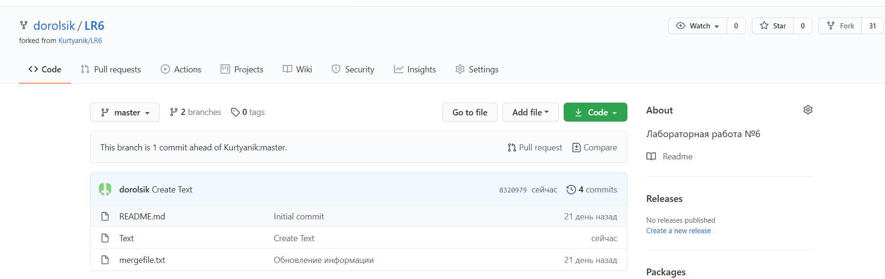
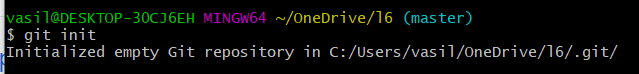
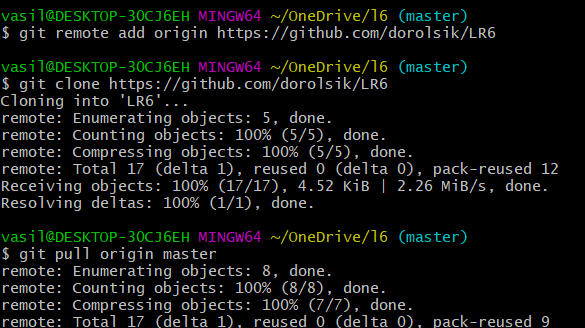
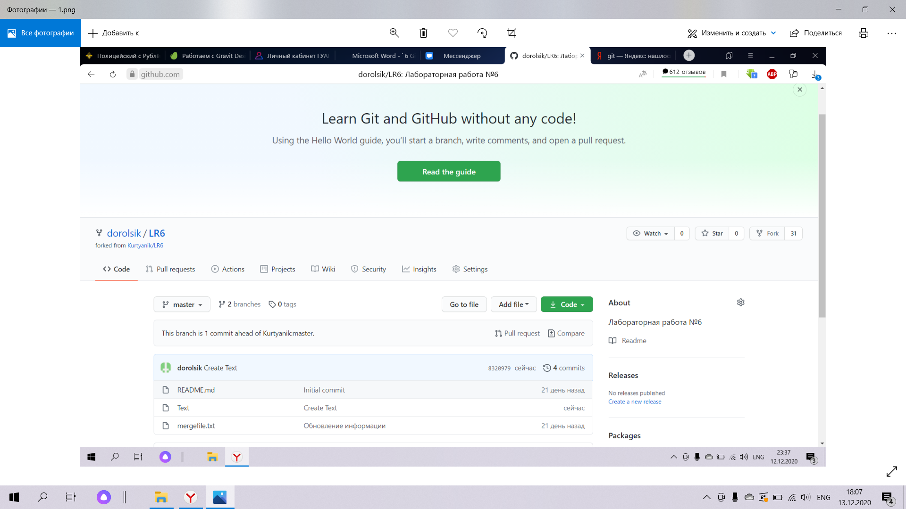
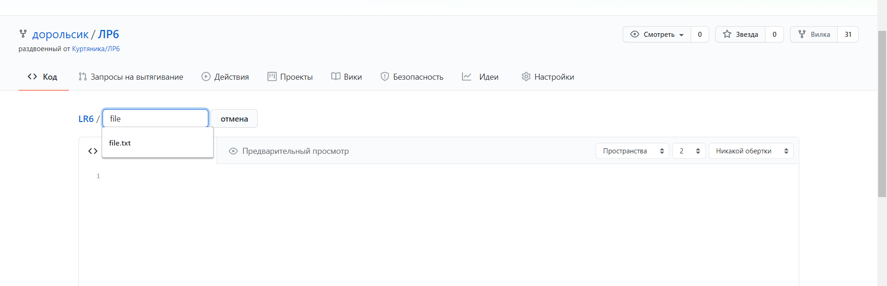
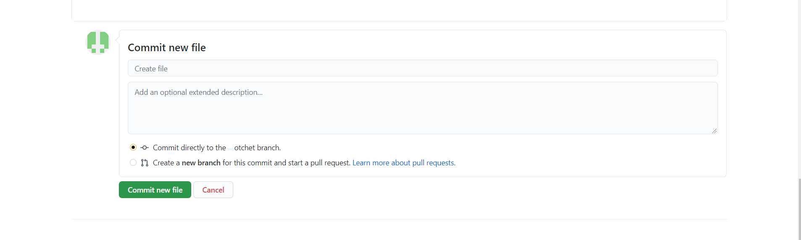

# LR6
Генрихов Василий 4916 Лабораторная работо 6

На сайте GitHub сделал копию https://github.com/Kurtyanik/LR6/

С помощью команды _cd laba6_ в консоли Git Bash перешёл в созданную папку laba6

Использовал команду _git init_ чтобы инициализировать гит в данной папке

Командой _git cjnfing --global user.name/email_ внес свои данные.

Командой _git remote add origin_ связал папку с удалённым репозиторием на сайте GitHub

Затем через графический интерфейс GitHub добавил новый файл _file.txt_ в удалённый репозиторий в ветку __master__

Пользуясь командой _git pull origin master_ загрузил изменения из удалённого репозитория в локальный

Командой _git log_ получил список операций/коммитов

Используя _git show *commit SHA-1*_ получил более подробную информацию по последнему изменению

Командой _git checkout -t branch1_ переключился на другую ветку **branch1**

Попытался выполнить слияние веток **master** и **branch1** командой _git merge branch1_ и получил ошибку

Вручную изменил файл mergefile.txt, вызвавший ошибку слияния и выполнил коммит

Выполнил слияние веток **master** и **branch1** а затем удалил ветку **branch1** командой _it

Запушил всё в удалённый репозиторий командой _git push origin master_ (Строка logon failed вылезает из-за какой-то внутренней ошибки)

![Push1] (скриншоты / Screenshot_17.формат PNG)

Затем сделал несколько изменений, добавив новые файлы

![Новые файлы] (скриншоты / Screenshot_19.формат PNG)

![Новые файлы git] (скриншоты / Screenshot_20.формат PNG)

Командой _git reset --hard HEAD~1_ выполнил откат последнего коммита - добавления файла **Новый текстовый документ.формат txt**

![Жесткий сброс] (скриншоты / Screenshot_22.формат PNG)

Запушил изменённую ветку

![Push2] (скриншоты / Screenshot_23.формат PNG)

![РезультатPush2] (скриншоты / Screenshot_24.формат PNG)

Пользуясь командой _git checkout -b otchet_ создал новую ветку **otchet**

![Новая ветвь] (скриншоты / Screenshot_25.формат PNG)

Текущая история _git log --graph_ . Аргумент --graph позволяет графически изобразить ветки и коммиты на них

С помощью команды _git add ._ подготовил все новые файлы в папке **lab6** к пушу

![Мерзавец добавляет .] (скриншоты/Screenshot_28.формат PNG)

Запушил файлы скриншотов в удалённый репозиторий

Оформляю отчёт в файле **README.md** используя блокнот

Лог команд из папки **.git / журналы**

![Журналы] (скриншоты / Screenshot_30.формат PNG)

Финальный результат команды _git log_

![Git log3] (скриншоты / Screenshot_32.формат PNG)

Все файлы скриншотов лежат в папке **screenshots**
